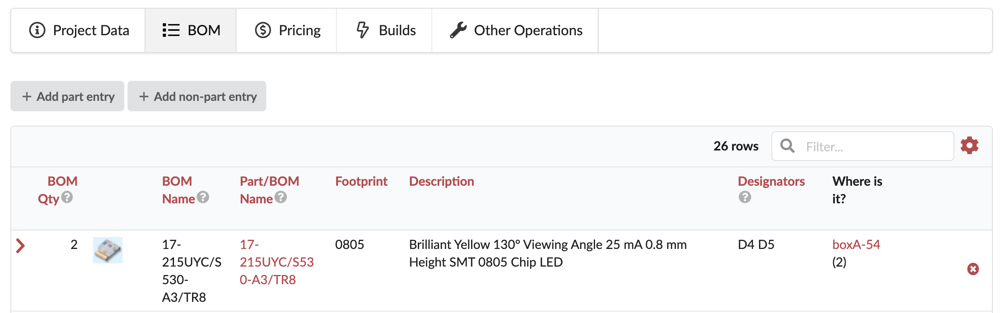

# BOM import from KiCad to PartsBox

> Import BOM information from [KiCad](https://kicad.org/) and match it with existing parts in [PartsBox](https://partsbox.com/) with a [CSV file](https://partsbox.com/how-to-generate-a-bom-from-kicad.html) that is generated by this python script.

## Install

```sh
git clone git@github.com:hutscape/kicad-partsbox-import.git
```

## Getting Started

1. Ensure your KiCad project has `*.xml` file
1. Run the python script

    ```sh
    $ python main.py PATH_TO_KICAD_XML.xml OUTPUT_FILENAME.csv
    ```
1. Ensure `OUTPUT_FILENAME.csv` has the header as the following:

    ```sh
    "Id";"Designator";"Package";"Quantity";"Designation";"Supplier and ref";
    ```
1. Ensure the column **Designation** (from KiCad) is the same as column **Part** in PartsBox. E.g. MPN is matched here:

    ```csv
    "Id";"Designator";"Package";"Quantity";"Designation";"Supplier and Ref"
    "7";"D4, D5, ";"Passives_0805:LED_0805_2012Metric_Pad1.15x1.40mm_HandSolder";"2";"17-215UYC/S530-A3/TR8";"LED: Light emitting diode"
    ```

    
